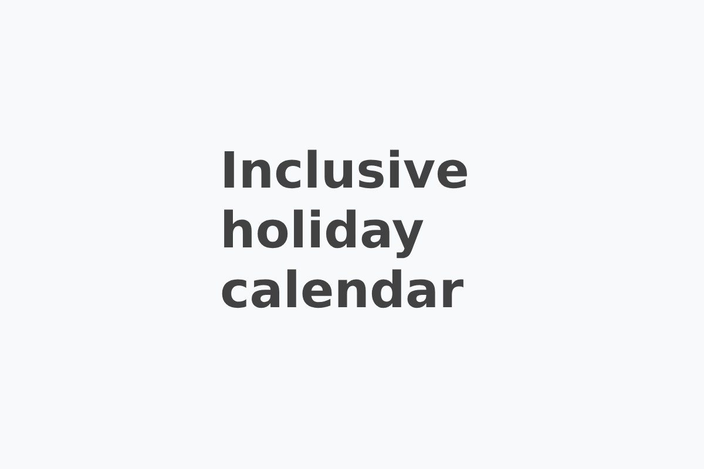

# Inclusive holiday calendar



## How to contribute

If you'd like to propose a new holiday to be added, you can either reach out to me [via email or on Mastodon](https://stefanbohacek.com/contact/), or if you prefer direct contribution to the project, you can add the event to the [events-monthly.json](https://github.com/stefanbohacek/holidays/blob/main/_data/events-monthly.json) file in the following format:


```json
 {
    "name": "Holiday name",
    "description": "A brief description.",
    "links": [
      {
        "title": "Source",
        "url": "https://en.wikipedia.org/example"
      }
    ],
    "month": 5,
    "tags": ["tag1", "tag2", "tag3"]
  }
```

For national holidays, be sure to include the `national` tag, and also tags that include a name of the country where the holiday is celebrated, for example `national-usa` or `national-australia`.

For source links, Wikipedia articles are prefered. For holidays that have a specific start and end date (which may be the same), use the `start_date` and `end_date` fields:

```json
{
  "start_date": "09-15",
  "end_date": "10-15"
}
```


